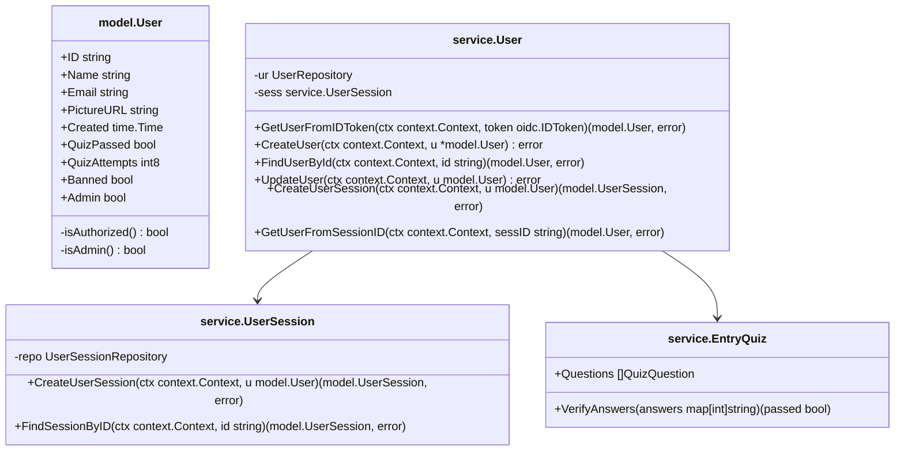

## Project Structure

QuoteServer is based on a hexagonal architecture (also known as ports and adapters), which permit swapping both the database / storage infrastructure as well as the front end presentation layer, with minimal changes to the codebase and preservation of the core application logic. 

To accomplish this, the application is broken down into three primary tiers:

- **`server`**
    - Provides an interface to the services for client interaction.
    - Currently implemented adapters:
        - `http` - uses Go templating to perform server side rendering and provide an interface to the application from a browser.
- **`service`**
    - Core application logic.
    - Shared across all server and storage implementation.
    - Each service requires a unique repository to maintain on it's data.
    - Some services interface with sub-services, and abstract their methods for use by the server.
- **`storage`**
    - Application state storage
    - Comprised of multiple repositories, each one tasked with storing a specific, consistent type of data.
    - Currently implemented adapters:
        - `inmemory` - stores all data in maps in memory, useful for testing.

In addition, each layer depends on the **`model`** package, which holds all of the structure definitions for objects used throughout the above three tiers. 

